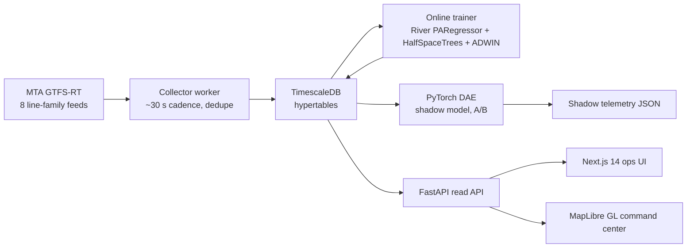

# MTA-Scan — unsupervised anomaly detection on live NYC Subway feeds

Polls 8 MTA GTFS-Realtime protobuf feeds every ~30 s, computes per-stop headway
residuals, and scores anomalies with an online model that retrains in place and needs
**zero labels**. Includes a replay harness that scores the same pipeline against three
heuristic baselines.

[](https://github.com/stelioszach03/NYC-Subway-Anomaly-Detection/actions)
[](LICENSE)
[](https://www.python.org/)

---

## Results — replay evaluation vs 3 baselines

The point of this table is the **trade-off**, not a win: the online model detects all three
incidents with the longest lead time, and pays for it with the highest false-alarm rate.

| Method | False-alarm rate | MRR | p@5 | p@20 | r@20 | Incidents found | Avg lead time | Avg time-to-detect |
|---|---:|---:|---:|---:|---:|---:|---:|---:|
| **Online model** (River) | 0.030 | 0.199 | 1.00 | **0.80** | **1.000** | **3 / 3** | **6.67 min** | **0.0 min** |
| z-score baseline | 0.010 | 0.128 | 0.80 | 0.50 | 0.625 | 3 / 3 | 5.00 min | 5.0 min |
| EWMA baseline | 0.005 | 0.181 | 0.80 | 0.50 | 0.625 | 3 / 3 | 2.50 min | 5.0 min |
| Fixed-threshold baseline | **0.000** | 0.184 | 1.00 | 0.50 | 0.625 | 1 / 3 | 0.00 min | 5.0 min |

Evidence: [`docs/generated/replay/metrics.json`](docs/generated/replay/metrics.json) ·
dataset card in [`docs/generated/replay/summary.json`](docs/generated/replay/summary.json) ·
method notes in [`docs/EVALUATION.md`](docs/EVALUATION.md).

**Read the dataset size before the numbers.** The replay set is
[`evaluation/data/sample_subway_headways.csv`](evaluation/data/sample_subway_headways.csv):
**216 rows, 16 positive rows, 3 routes, 6 stops, 3 hand-labelled incidents**, threshold 0.6.
That is a sanity evaluation, not a benchmark — 16 positives cannot separate these methods
with any confidence, and the incidents are representative scenarios rather than official MTA
incident annotations. The interesting part is that the fixed-threshold rule has a *perfect*
false-alarm rate and still misses two of three incidents.

Reproduce it in about a second:

```bash
PYTHONPATH=. python scripts/run_replay_eval.py \
  --input evaluation/data/sample_subway_headways.csv \
  --out-dir docs/generated/replay
```

The output is byte-identical to what is committed. It was not, until the categorical hash
features were switched off Python's `hash()` — see *Reproducibility* below.

## What it does


```mermaid
flowchart LR
    A["MTA GTFS-RT<br/>8 line-family feeds"] --> B["Collector worker<br/>~30 s cadence, dedupe"]
    B --> C["TimescaleDB<br/>hypertables"]
    C --> D["Online trainer<br/>River PARegressor + HalfSpaceTrees + ADWIN"]
    D --> C
    C --> E["PyTorch DAE<br/>shadow model, A/B"]
    E --> F["Shadow telemetry JSON"]
    C --> G["FastAPI read API"]
    G --> H["Next.js 14 ops UI"]
    G --> I["MapLibre GL command center"]
```

- **Online learning, no labels.** `PARegressor` predicts the next headway; the residual is
  the anomaly signal, calibrated against a rolling quantile so no ground truth is needed.
  `HalfSpaceTrees` adds an unsupervised second opinion. `ADWIN` resets the model on drift.
- **Shadow model.** A PyTorch denoising autoencoder trains on a sliding window and runs in
  parallel purely as a drift/quality cross-check — it does not feed the served score.
- **Score composition** (`worker/ml_online.py`):

  | Component | Weight |
  |---|---:|
  | Rolling-quantile-calibrated residual | 0.50 |
  | HalfSpaceTrees anomaly score | 0.30 |
  | Relative error `\|obs − pred\| / max(pred, 60 s)` | 0.20 |

  `score ≥ 0.60` → anomaly, `score ≥ 0.85` → critical.
- **31 numeric features** (`NUMERIC_FEATURE_COLUMNS` in `worker/features.py`), of which 16
  carry a written rationale — hour, day-of-week, peak/weekend flags, two headway lags,
  rolling mean/std/q10/q90, station-local MAD-scaled deviation, feed staleness, direction,
  plus optional weather and service-alert hooks. Listed in
  [`docs/generated/replay/summary.json`](docs/generated/replay/summary.json).
- **Retention-aware checkpointing** — keeps the N most recent bundles (default 5). Added
  after unbounded saves filled **37 GB** of disk.

## Quickstart — verified on macOS 15 / Python 3.11

Tests and the replay evaluation need no database, no Docker and no network:

```bash
python3.11 -m venv .venv && source .venv/bin/activate
pip install -r requirements.txt -r requirements-dev.txt

PYTHONPATH=. pytest -q          # 11 passed, 4 skipped (integration) in ~2 s
ruff check .                    # clean
PYTHONPATH=. python scripts/run_replay_eval.py \
  --input evaluation/data/sample_subway_headways.csv --out-dir /tmp/replay
```

The full stack needs Docker:

```bash
cp infra/.env.example infra/.env
docker compose up -d --build db api worker trainer dl_shadow ui
# UI      http://localhost:3000/map
# health  http://localhost:8000/api/health/deep
```

Six services: `db` (TimescaleDB PG16), `worker` (collector, 30 s), `trainer` (River, 5 s tick),
`dl_shadow` (PyTorch DAE, 120 s tick), `api` (FastAPI), `ui` (Next.js 14 standalone).

## Reproducibility

`worker/features.py` hashes `route_id`, `stop_id` and route-direction into numeric features.
It used Python's builtin `hash()`, which CPython **randomizes per process** via
`PYTHONHASHSEED`. Consequences, both real:

1. the replay evaluation produced different `p@k` and MRR on every run;
2. more seriously, a model checkpoint reloaded after a restart was scoring a *different*
   feature space than the one it was trained on.

It now uses `blake2b`. `tests/test_feature_hash_stability_unit.py` pins the values and
re-runs them in subprocesses under three different `PYTHONHASHSEED` settings. The committed
replay artifacts were regenerated after the fix, so the numbers in the table above are the
numbers you get.

## API

| Method | Path | Description |
|---|---|---|
| `GET` | `/api/health` | liveness |
| `GET` | `/api/health/deep` | DB freshness, GTFS availability, model telemetry, data age |
| `GET` | `/api/summary?window=15m` | station/train counts, anomaly count and rate |
| `GET` | `/api/anomalies?window=15m&route_id=All&limit=400` | event-level anomaly rows |
| `GET` | `/api/heatmap?ts=now&window=60m&route_id=All` | GeoJSON, top-scoring event per stop |
| `GET` | `/api/routes` · `/api/stops` | routes seen in 24 h · static GTFS stops |
| `GET` | `/api/model/telemetry` · `/api/model/telemetry/dl-shadow` | River and DAE telemetry |

## What this does not do

- **The evaluation is 216 rows and 3 incidents.** No claim about detection quality at scale
  is supported by anything in this repository. Point estimates on 16 positives are noisy;
  no confidence intervals are computed.
- **Labels are hand-made.** The three replay incidents are representative scenarios, not
  official MTA incident annotations. There is no labelled historical archive here.
- **The online model is not tuned for offline accuracy.** It is tuned for responsiveness on
  a streaming feed, and the table shows it carries the highest false-alarm rate of the four
  methods.
- **A headway anomaly is not a root cause.** The reason strings are factor attributions, not
  causal explanations.
- **No static GTFS data is committed** (`gtfs_subway/` holds only a `.gitkeep`), so
  `/api/stops` and the map layers are empty until the static feed is downloaded.
- **PyTorch is not in `requirements.txt`** — it is installed only inside
  `docker/Dockerfile.worker`. The DAE shadow model does not run in a plain local venv.
- **Integration tests are skipped by default**; they need a live Postgres and outbound
  network to the MTA endpoints (`TEST_ALLOW_NETWORK=1`).
- Cold-start scoring is noisy, and schedule changes or feed resets can produce false
  positives. More in [`docs/LIMITATIONS.md`](docs/LIMITATIONS.md).

## Layout

```text
api/app/         FastAPI: routers, SQLAlchemy models, storage, config
worker/          collector.py (GTFS-RT + dedupe), ml_online.py (River),
                 ssl_shadow.py (PyTorch DAE), drift.py (ADWIN + retention saver),
                 features.py (feature engineering)
evaluation/      replay.py, baselines.py, metrics.py, artifacts.py + sample dataset
ui/              Next.js 14 operator dashboard
landing/         static landing page + MapLibre GL command center
docs/            DATA_CARD, MODEL_CARD, EVALUATION, LIMITATIONS + generated replay artifacts
db/migrations/   Postgres/Timescale migrations
tests/           11 unit + 4 integration tests
```

4,074 lines of Python, 2,139 lines of TypeScript/TSX. CI runs ruff, the unit suite, and
builds all three Docker images on every push.

## License

MIT — see [`LICENSE`](LICENSE).
