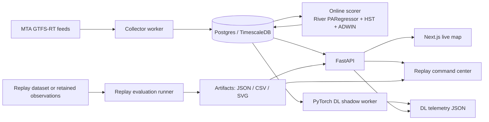

# NYC Subway Anomaly Detection

Production-style anomaly intelligence for NYC Subway operations, with live GTFS-RT ingestion, online headway scoring, replay evaluation, and an operator-facing command center.

[](#)
[](#)
[](#)
[](#)
[](LICENSE)

Live pages:
- live map: `https://stelioszach.com/nyc-subway-anomaly/map`
- replay command center: `https://stelioszach.com/nyc-subway-anomaly/replay`

## Project Pitch

Subway incidents often show up first as route-stop headway distortions, stale updates, and corridor-local service imbalance. This project ingests GTFS-RT in real time, scores headway anomalies with a hybrid online ML stack, and exposes both a live operator view and a reproducible replay evaluation workflow.

## Why It Matters

Most transit anomaly demos stop at a dashboard or a notebook. This repository goes further:

- live ingestion from public MTA Subway feeds
- stateful online scoring with drift handling
- route-stop spatial UI for operations-style triage
- replay evaluation with baseline comparisons
- case studies and generated artifacts for engineering review

The goal is not only to look good in a portfolio. The goal is to read like a compact ML systems project that could plausibly sit behind an internal transit intelligence workflow.

## Key Features

### Live anomaly pipeline
- GTFS-RT collector writes headway observations into Postgres / TimescaleDB
- River online learner predicts expected headway and emits anomaly scores
- ADWIN detects distribution drift and resets the learner when needed
- FastAPI serves summary, anomaly, heatmap, health, model telemetry, and replay artifacts
- Next.js UI renders a live command center over the scored stream

### Stronger model context
- hour of day and day of week
- rush-hour and weekend indicators
- lagged headway features
- rolling mean, std, and quantiles
- station-local median / MAD deviation
- route-direction context inferred from stop IDs
- feed freshness / stale-update indicators
- optional weather and service-alert hooks

### Replay evaluation and proof
- chronological replay runner using the same online scoring path as production
- baseline comparisons against z-score, EWMA, and fixed threshold rules
- precision@k, recall@k, false-alarm rate, incident detection rate, and timing metrics
- generated CSV / JSON / SVG artifacts for reproducibility and UI integration

### Replay UI / storytelling
- dedicated replay command center page
- timeline scrubber
- model-vs-baseline chart
- top affected routes and stops
- “why flagged?” factor panel
- incident summaries backed by generated artifacts

## Architecture


```mermaid
flowchart LR
  A[MTA GTFS-RT feeds] --> B[Collector worker]
  B --> C[(Postgres / TimescaleDB)]
  C --> D[Online scorer\nRiver PARegressor + HST + ADWIN]
  D --> C
  C --> E[FastAPI]
  E --> F[Next.js live map]
  E --> G[Replay command center]
  H[Replay dataset or retained observations] --> I[Replay evaluation runner]
  I --> J[Artifacts: JSON / CSV / SVG]
  J --> E
  J --> G
  C --> K[PyTorch DL shadow worker]
  K --> L[DL telemetry JSON]
  E --> L
```

## Repository Layout

```text
api/                    FastAPI app and routers
worker/                 GTFS collector, online scorer, drift handling, feature engineering
ui/                     Next.js operator UI (`/map`, `/replay`)
evaluation/             Replay evaluation logic and baselines
evaluation/data/        Representative replay dataset
docs/generated/replay/  Generated replay artifacts used by API and UI
docs/case-studies/      Portfolio-style incident writeups
tests/                  Unit and integration tests
scripts/                Smoke and replay commands
```

## Screens / Artifacts

Reference artifacts committed in the repo:
- replay score comparison plot: [`docs/generated/replay/plots/overall-scores.svg`](docs/generated/replay/plots/overall-scores.svg)
- signal-delay case study plot: [`docs/generated/replay/plots/signal-delay-midtown.svg`](docs/generated/replay/plots/signal-delay-midtown.svg)
- replay summary artifact: [`docs/generated/replay/summary.json`](docs/generated/replay/summary.json)

## How Scoring Works

For each route-stop observation, the online scorer now combines:

1. prediction residual from the online regressor,
2. self-supervised residual calibration,
3. Half-Space Trees anomaly signal,
4. contextual deviation signals from local rolling behavior,
5. optional operational context such as stale updates, weather, and service alerts.

This keeps the fast online path intact while making the score much more sensitive to operationally meaningful changes.

## Replay Evaluation

Run the default replay bundle:

```bash
PYTHONPATH=. python scripts/run_replay_eval.py \
  --input evaluation/data/sample_subway_headways.csv \
  --out-dir docs/generated/replay
```

Generated artifacts:
- `summary.json`
- `metrics.json`
- `timeline.json`
- `incidents.json`
- `events.csv`
- `plots/*.svg`

Read more:
- [`docs/EVALUATION.md`](docs/EVALUATION.md)
- [`docs/case-studies/01-signal-delay-midtown.md`](docs/case-studies/01-signal-delay-midtown.md)
- [`docs/case-studies/02-brooklyn-merge-bunching.md`](docs/case-studies/02-brooklyn-merge-bunching.md)
- [`docs/case-studies/03-queens-rain-cascade.md`](docs/case-studies/03-queens-rain-cascade.md)

## Local Development

### Prerequisites
- Python 3.11+
- Node 18+
- Docker + Docker Compose
- optional Mapbox token for the live map

### 1. Python environment

```bash
python3 -m venv .venv
. .venv/bin/activate
pip install -r requirements.txt -r requirements-dev.txt
```

### 2. Start backend services

```bash
docker compose up -d --build db api worker trainer
```

### 3. Start the UI

```bash
cd ui
npm install
npm run dev
```

Open:
- `http://localhost:3000/map`
- `http://localhost:3000/replay`

## VPS / Base-Path Deployment

For deployment behind `/nyc-subway-anomaly`:

```bash
docker compose -f docker-compose.vps.yml up -d --build
```

The UI is base-path aware and rewrites API calls to the backend service.

## Tests

Python unit tests:

```bash
PYTHONPATH=. pytest -q -m "not integration"
```

Integration tests:

```bash
TEST_ALLOW_NETWORK=1 PYTHONPATH=. pytest -q -m integration
```

Frontend smoke tests:

```bash
cd ui
npm install
npm test
```

## Documentation

Project docs:
- [`docs/upgrade-plan.md`](docs/upgrade-plan.md)
- [`docs/EVALUATION.md`](docs/EVALUATION.md)
- [`docs/MODEL_CARD.md`](docs/MODEL_CARD.md)
- [`docs/DATA_CARD.md`](docs/DATA_CARD.md)
- [`docs/LIMITATIONS.md`](docs/LIMITATIONS.md)

## Current Limitations

- replay labels are representative scenario labels, not official incident truth
- GTFS-RT quirks and schedule changes can still create false positives
- the online model is optimized for operational responsiveness, not offline benchmark dominance
- route topology propagation and official alert ingestion are still limited

See [`docs/LIMITATIONS.md`](docs/LIMITATIONS.md) for the full discussion.

## Roadmap

- evaluate on retained real historical incident windows
- ingest official service alerts automatically
- add route topology / corridor propagation features
- compare the online scorer against a stronger offline sequence model
- add richer operator feedback loops for labeling and threshold tuning

## License

MIT. See [LICENSE](LICENSE).
